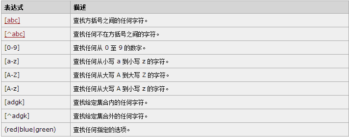

# 
javascript高级 第一章
 #

# 1.本门课程内容 #

　　1. 正则表达式  
　　2. AJAX  
　　3. 面向对象  

# 2. 本章任务 #

　　1.表单验证
　　2.将阿拉伯数字转换成大写 
　　     
  

# 3. 本章内容 #

　　1.理解正则表达式的作用  
　　2.创建正则的方式  
　　3.String对象使用正则  
　　4.正则表达式的编写  
　　5.正则表达式捕获组
　　6.正则表达式反向引用
　　

# 3.1 认识正则

## 3.1.1 本质及作用 ##
   正则表达式（英文：Regular Expression）  
   本质：用来记录文本规则的代码  
   作用：应用非常广泛，如：表单验证、高级所搜等

## 3.1.2 创建正则的方式 ##

   1.通过构造函数定义  
　　　　　var 变量名= new RegExp(pattern,attributes);

   2.通过直接量定义  
　　　　　var 变量名= /pattern/attributes;   
参数：参数pattern是一个字符串，指定了正则表达式的模式；参数attributes是一个可选的参数，包含属性 g，i，m，分别使用与全局匹配，不区分大小写匹配，多行匹配；

# 3.2 支持正则表达式的String对象的方法 #

## 3.2.1 search()方法 ##
　　该方法用于检索字符串中指定的子字符串，或检索与正 则表达式相匹配的字符串。

   基本语法：stringObject.search(regexp);

   @param 参数regexp可以需要在stringObject中检索的字符串，也可以 是需要检索的RegExp对象。

   @return(返回值) stringObject中第一个与regexp对象相匹配的子串的起 始位置。如果没有找到任何匹配的子串，则返回-1；

　　　javascript代码：  

		var str = "hello world,hello world";
		// 返回匹配到的第一个位置(使用的regexp对象检索)
		console.log(str.search(/hello/)); // 0
		// 没有全局的概念 总是返回匹配到的第一个位置
		console.log(str.search(/hello/g)); //0
		
		console.log(str.search(/world/)); // 6
		
		// 也可以是检索字符串中的字符
		console.log(str.search("wo")); // 6
		
		// 如果没有检索到的话，则返回-1
		console.log(str.search(/longen/)); // -1
		
		// 我们检索的时候 可以忽略大小写来检索
		var str2 = "Hello";
		console.log(str2.search(/hello/i)); // 0

　　5分钟实验时间，看看结果是什么？

## 3.2.2 match()方法 ## 
   该方法用于在字符串内检索指定的值，或找到一个或者多个正则表达式的匹配。该方法类似于indexOf()或者lastIndexOf(); 但是它返回的是指定的值，而不是字符串的位置；  

   基本语法：

   stringObject.match(searchValue) 或者stringObject.match(regexp)

   @param(参数) 

   searchValue 需要检索字符串的值；

   regexp: 需要匹配模式的RegExp对象；

   @return(返回值) 存放匹配成功的数组; 它可以全局匹配模式，全局匹配的话，它返回的是一个数组。如果没有找到任何的一个匹配，那么它将返回的是null；返回的数组内有三个元素，第一个元素的存放的是匹配的文本，还有二个对象属性；index属性表明的是匹配文本的起始字符在stringObject中的位置；input属性声明的是对stringObject对象的引用；

	var str = "hello world";
	console.log(str.match("hello")); // ["hello", index: 0, input: "hello world"]
	console.log(str.match("Hello")); // null
	console.log(str.match(/hello/)); // ["hello", index: 0, input: "hello world"]
	// 全局匹配
	var str2="1 plus 2 equal 3"
	console.log(str2.match(/\d+/g)); //["1", "2", "3"]

## 3.2.3 replace()方法 ##

   该方法用于在字符串中使用一些字符替换另一些字符，或者替换一个与正则表达式匹配的子字符串；

   基本语法：stringObject.replace(regexp/substr,replacement);

   @param(参数) 

   regexp/substr; 字符串或者需要替换模式的RegExp对象。

   replacement：一个字符串的值，被替换的文本或者生成替换文本的函数。

   @return(返回值)  返回替换后的新字符串

   注意：字符串的stringObject的replace()方法执行的是查找和替换操作，替换的模式有2种，既可以是字符串，也可以是正则匹配模式，如果是正则匹配模式的话，那么它可以加修饰符g,代表全局替换，否则的话，它只替换第一个匹配的字符串；

	var str = "hello world";
	// 替换字符串
	var s1 = str.replace("hello","a");
	console.log(s1);// a world
	// 使用正则替换字符串
	var s2 = str.replace(/hello/,"b");
	console.log(s2); // b world
	
	// 使用正则全局替换 字符串
	var s3 = str.replace(/l/g,'');
	console.log(s3); // heo word

## 3.2.4  split()方法 ##

该方法把一个字符串分割成字符串数组。
  
基本语法如：stringObject.split(separator,howmany);

@param(参数) 

   1. separator[必填项]，字符串或正则表达式，该参数指定的地方分割stringObject; 

   2. howmany[可选] 该参数指定返回的数组的最大长度，如果设置了该参数，返回的子字符串不会多于这个参数指定的数组。如果没有设置该参数的话，整个字符串都会被分割，不考虑他的长度。

  @return(返回值) 一个字符串数组。该数组通过在separator指定的边界处将字符串stringObject分割成子字符串。

	var str = "what are you doing?";
	// 以" "分割字符串
	console.log(str.split(" "));
	// 打印 ["what", "are", "you", "doing?"]
	
	// 以 "" 分割字符串
	console.log(str.split(""));
	/*
	 * 打印：["w", "h", "a", "t", " ", "a", "r", "e", " ", "y", "o", "u", " ", "d", "o", "i", "n", 
	 * "g", "?"]
	 */
	// 指定返回数组的最大长度为3
	console.log(str.split("",3));
	// 打印 ["w", "h", "a"]

# 3.3 RegExp对象 #

   Sting对象的上述方法，只是对RegExp对象中的方法进行的封装。现在我们来学习RegExp对象的常用方法。  

## 3.3.1 test() 方法 ##
　　　用于检测一个字符串是否匹配某个模式.
     
   基本语法：RegExpObject.test(str);

   @param(参数) str是需要检测的字符串；

   @return (返回值) 如果字符串str中含有与RegExpObject匹配的文本的话，返回true，否则返回false；

	var str = "Visit W3School";
	var patt1 = new RegExp("W3School");
	
	var result = patt1.test(str);
	
	document.write("Result: " + result);
　　　
## 3.3.2 exec() 方法 ##

该方法用于检索字符串中的正则表达式的匹配。  

基本语法：RegExpObject.exec(string)

@param(参数)：string【必填项】要检索的字符串。

@return(返回值)：返回一个数组，存放匹配的结果，如果未找到匹配，则返回值为null；

注意：该返回的数组的第一个元素是与正则表达式相匹配的文本，该方法还返回2个属性，index属性声明的是匹配文本的第一个字符的位置；input属性则存放的是被检索的字符串string；该方法如果不是全局的话，返回的数组与match()方法返回的数组是相同的。

	var str = "longen and yunxi";
	console.log(/longen/.exec(str)); 
	// 打印 ["longen", index: 0, input: "longen and yunxi"]
	
	// 假如没有找到的话，则返回null
	console.log(/wo/.exec(str)); // null

但是，当 RegExpObject 是一个全局正则表达式时，exec() 的行为就稍微复杂一些。它会在 RegExpObject 的 lastIndex 属性指定的字符处开始检索字符串 string。当 exec() 找到了与表达式相匹配的文本时，在匹配后，它将把 RegExpObject 的 lastIndex 属性设置为匹配文本的最后一个字符的下一个位置。这就是说，您可以通过反复调用 exec() 方法来遍历字符串中的所有匹配文本。当 exec() 再也找不到匹配的文本时，它将返回 null，并把 lastIndex 属性重置为 0。

	var str = "Visit W3School"; 
	var patt = new RegExp("W3School","g");
	var result;
	
	while ((result = patt.exec(str)) != null)  {
	  document.write(result);
	  document.write(" ");
	  document.write(patt.lastIndex);
	 }
   

# 3.4  正则表达式 #
  
　　正则表达式用来表示一种格式或规则，比如我们常用的邮箱格式、手机号码格式、日期格式等。那么我们如何将这些格式表示出来呢？可以使用下面的符号来完成各种格式的编写。

## 3.4.1 普通字符 ##
　　字母，数字，汉字，下划线及一些没有特殊定义的标点符号，都属于普通字符，正则中的普通字符，在匹配字符串的时候，匹配与之相同的字符即可~ 比如如下代码：
  　
	var str = "abcde";
	
	console.log(str.match(/a/)); // ["a", index: 0, input: "abcde"]
## 3.4.2 方括号 ##
   方括号用于查找某个范围内的字符，方括号包含一系列字符，能够匹配其中任意一个字符。如[abc]可以匹配abc中任意一个字符，使用[^abc]包含的字符abc，则能够匹配abc字符之外的任何一个字符，只能是一个字符。  
　　
  

## 3.4.3 元字符##
   元字符（Metacharacter）是拥有特殊含义的字符

	var str = "abcde111";
	//\w; 查找任意一个字母或数字或下划线，等价于A_Za_z0_9,_
	// 匹配单个字符，找到一个直接返回
	console.log(str.match(/\w/)); // ["a", index: 0, input: "abcde"]
	// 匹配所有字符
	console.log(str.match(/\w+/)); //["abcde", index: 0, input: "abcde"]
	//\W; 查找非单词的字符，等价于[^A_Za_z0_9_] 
	console.log(str.match(/\W/)); // null
	//\d；匹配与一个数字字符，等价于[0-9];
	console.log(/\d/g.exec(str)); // ["1", index: 5, input: "abcde111"]
	// \D; 匹配一个非数字字符，等价于[^0-9]
	console.log(/\D+/g.exec(str)); // ["abcde", index: 0, input: "abcde111"]
	//\s；匹配任何空白字符，包括空格，制表符，换行符等等。等价于[\f\n\r\t\v]
	var str1="Is this all there is?";
	console.log(/\s/g.exec(str1)); // [" ", index: 2, input: "Is this all there is?"]
	//\S；匹配任何非空白字符，等价于[^\f\n\r\t\v]
	console.log(/\S+/g.exec(str1)); // ["Is", index: 0, input: "Is this all there is?"]
	//\b; 匹配一个单词边界，也就是指单词和空格间的位置，比如’er\b’可以匹配”never”中的”er”,但是不能匹配”verb”中的”er”
	console.log(/\bthis\b/g.exec(str1)); // ["this", index: 3, input: "Is this all there is?"]
	//\n; 匹配一个换行符;返回换行符被找到的位置。如果未找到匹配，则返回 -1。
	console.log(/\n/g.exec(str1)); // ["换行符", index: 12, input: "Is this all ↵there is?"]
## 3.4.4 量词 ##

　　"*"	重复零次或更多 x>=0  

　　"+"	重复一次或更多次 x>=1

　　"?"	重复零次或一次  x=(0||1)

　　{n}	n次	x=n

　　{n,}	重复n次或更多  x>=n

　　{n,m} 重复出现的次数比n多但比m少 n<=x<=m

　　*　　{0,}  
　　+　　{1,}  
　　?　　{0,1}  

1.n+ 匹配至少包含一个或者多个n的字符串
	var str = "hello longen";
	
	// 匹配至少一个或者多个l的字符串
	
	console.log(str.match(/l+/g)); //["ll", "l"]
	
	// 匹配至少一个或者多个字母数字或者下划线
	
	console.log(str.match(/\w+/g)); //["hello", "longen"]

	var str = "hello longen hello";
2  n* 匹配零个或者多个n的字符串

		// 匹配至少零个或者多个l的字符串 
		console.log(str.match(/\w+/g)); //["hello", "longen"]  
	
		// 可以匹配多个l或者不匹配l 全局匹配
		
		console.log(str.match(/el*/g)); //["ell", "e", "ell"]
		
		// 可以匹配多个u或者不匹配u 全局匹配
		
		console.log(str.match(/hu*/g)); //["h", "h"]

3  n？匹配零个或者1个n的字符串，可以匹配n字符串，也可以只匹配一个n；先尽量匹配，如没有匹配到，就回溯，再进行不匹配；

		var str = "hello longen hello";
		
		// 匹配至少零个或者1个l的字符串 
		
		console.log(str.match(/el?/g)); //["el", "e", "el"]
		
		// 可以匹配1个u或者不匹配u 全局匹配
		
		console.log(str.match(/hu?/g)); //["h", "h"]

4  n{x}  匹配包含x个的n的序列字符串。X必须是数字。

		var str="100, 1000 or 10000?";
		
		// 匹配4个数字的 匹配到1000和10000
		
		console.log(str.match(/\d{4}/g)); //["1000", "1000"]

5 n{x,y} 匹配包含至少x个的n字符串，最多y个n字符串。

	var str="100, 1000 or 10000?";
	
	// 匹配最小3个数字，最多四个数字的 匹配到100，1000和10000
	
	console.log(str.match(/\d{3,4}/g)); //["100", "1000", "1000"]

6 n{x,} 匹配至少包含x个n序列的字符串；

	var str="100, 1000 or 10000?";
	
	// 匹配最小3个数字 匹配到100，1000和10000
	
	console.log(str.match(/\d{3,}/g)); //["100", "1000", "1000"]

## 3.4.5 边界 ##

　　　　^ 会匹配行或者字符串的起始位置

　　　　$ 会匹配行或字符串的结尾位置

	var str="my name is longen";
	
	// 匹配以en结尾的字符串
	
	console.log(str.match(/en$/g)); //["en"]
	
	// 匹配以my开头的字符串
	
	console.log(str.match(/^my/g)); //["my"]
	
	// 匹配以na开头的字符串,没匹配到，返回null
	
	console.log(str.match(/^na/g)); //null

## 3.4.6 ()括号  ##
　　在被修饰匹配次数的时候，括号中的表达式可以作为整体被修饰。  

	var str = "hello world";
	
	// 使用|的含义是 或者 匹配成功 结果为["hello "] 
	
	//如果再次匹配的话 就是world
	
	console.log(str.match(/(hello | world)/g)); // ["hello "]
## 3.4.7  \b  ##
   匹配一个单词边界，也就是单词与空格之间的位置，不匹配任何字符；
    
	var str="my name is longen";
	
	// 匹配单词边界的字符
	
	console.log(str.match(/\bname\b/g)); //["name"]
	
	// 如果不是单词边界的地方，就匹配失败
	
	console.log(str.match(/\blong\b/g)); // null

   
## 3.4.8  转义字符  ##
需要转义的特殊字符前面加 \

  匹配输入字符串的结尾位置，如果需要匹配匹配输入字符串的结尾位置，如果需要匹配本身的话，使用\$

  ^ 匹配输入字符串的开始位置，匹配^本身的话，使用\^

  * 匹配前面的子表达式的零次或者多次，匹配*本身的话，使用\*

  + 匹配子表达式的1次或者多次，匹配+本身的话，使用\+

  . 匹配除换行符之外的任何一个字符，匹配.本身的话，使用\.

  [ 匹配一个中括号开始，匹配本身的，使用\[

  ? 匹配前面的子表达式的零次或者1次，或指明一个非贪婪限定符，要匹配本身的话，使用\?

  \ 匹配本身的话，请使用\\

  { 标记限定符开始的地方，要匹配{ ,请使用\{

  | 指明多项中的一个选择，可以理解含义为或的意思，匹配本身的话，使用\|

  / 匹配本身的话，使用\/
## 3.4.9  理解正则表达式----环视  ##

 环视只进行子表达式匹配，不占有字符，匹配到的内容不保存到最终的匹配的结果，是零宽度的，它匹配的结果就是一个位置；环视的作用相当于对所在的位置加了一个附加条件，只有满足了这个条件，环视子表达式才能匹配成功。环视有顺序和逆序2种，顺序和逆序又分为肯定和否定，因此共加起来有四种；但是javascript中只支持顺序环视，因此我们这边来介绍顺序环视的匹配过程；

1.(?=Expression):  顺序肯定环视，含义是所在的位置右侧位置能够匹配到regexp.

	   示例1  
			var str="my name is longen";  
			// 匹配以na其后紧接m的字符串  
			// ?= 只是匹配位置，不会返回值  
			console.log(str.match(/na(?=m)/g)); //["na"]

       示例2：以字母或者数字组成的，并且第一个字符必须为小写字母开头；
			//var t = /^[a-z][a-z0-9]+$/;
			var t = /^(?=[a-z])[a-z0-9]+$/;
			var s = "a123";
			console.log(t.test(s));        
		
       

2.(?!Expression) 顺序否定环视，含义是所在的位置右侧位置不能匹配到regexp

		示例
		var str="my name is longen";
		
		// 匹配以na其后不紧接ma的字符串
		
		// ?! 只是匹配位置，不会返回值
		
		console.log(str.match(/na(?!ma)/g)); //["na"]
		
		console.log(str.match(/na(?!m)/g)); // null

		示例2 匹配除
之外的其余标签
 
		var str = "aa
one</pa>bb
two
cc";
		
		var patt = /<(?!\/?p\b)[^>]+>/g;
		var result = null;
		while ((result = patt.exec(str)) != null)  {
			  console.log(result);
			  console.log(patt.lastIndex);
		}

# 3.5 贪婪模式与非贪婪模式 #
  Javascript中的正则贪婪与非贪婪模式的区别是：被量词修饰的子表达式的匹配行为；贪婪模式在整个表达式匹配成功的情况下尽可能多的匹配；非贪婪模式在整个表达式匹配成功的前提下，尽可能少的匹配；  
  
一些常见的修饰贪婪模式的量词如下：  
{x,y} ,  {x,} ,  ? ,  * , 和  +  
那么非贪婪模式就是在如上贪婪模式后加上一个?(问号)，就可以变成非贪婪模式的量词；如下：    
{x,y}?，{x,}?，??，*?，和 +?

	var str = "longen
我是中国人
yunxi
我是男人
boyboy
我是中国人2
yunxi
我是男人
boyboy";
	// 非贪婪模式1
	console.log(str.match(/
.*?<\/p>boyboy/)[0]); 
	//
我是中国人
yunxi
我是男人
boyboy
	
	// 贪婪模式
	console.log(str.match(/
.*<\/p>yunxi/)[0]); 
	//
我是中国人
yunxi
我是男人
boyboy
我是中国人2
yunxi

# 3.5 正则表达式---捕获组 #

捕获组就是把正则表达式中子表达式匹配的内容，保存到内存中以数字编号或显示命名的组里，方便后面使用；可以在正则表达式内部使用，也可以在外部使用；

捕获组有2种，一种是捕获性分组，另一种是 非捕获性分组；

## 3.5.1 捕获性分组 ##

   捕获性分组的编号规则：编号是按照”(”出现的顺序，从左到右，从1开始进行编号  

示例一： 

		//分组的列子  
		console.log(/(longen){2}/.test("longen")); // false  
		console.log(/(longen){2}/.test("longenlongen")); //true  
		// 分组的运用 RegExp.$1 获取小括号的分组  
		var str = 11122;  
		/(\d+)/.test(str);  
		console.log(RegExp.$1); // 11122  
		
		// 使用replace替换 使用分组 把内容替换  
		var num = "11 22";  
		var n = num.replace(/(\d+)\s*(\d+)/,"$2 $1");  
		console.log(n); // 22 11  

示例二：将字符串中的网址都变为超链接显示

	var str = "http://www.baidu.com https://www.taobao.com http://www.sina.com";  
	console.log(str.match(/(http:\/\/|https:\/\/)\w+\.\w+\.\w+/));  
	var n = str.replace(/((http:\/\/|https:\/\/)\w+\.\w+\.\w+)/g,"<a href=$1>$1</a>");  
	document.write(n);  

## 3.5.2 非捕获性分组 ##

   并不是所有分组都能创建反向引用，有一种分组叫做非捕获性分组，它不能创建反向引用，要创建一个非捕获性分组，只要在分组的左括号的后面紧跟一个问号与冒号就ok；非捕获分组的含义我们可以理解为如下：子表达式可以作为被整体修饰但是子表达式匹配的结果不会被存储；如下：

	// 非捕获性分组
	var num2 = "11 22";
	/#(?:\d+)/.test(num2);
	console.log(RegExp.$1); //""
	我们再来看下使用 非捕获性分组来把页面上的所有标签都去掉，如下代码：
	// 把页面上所有的标签都移除掉
	var html = "
<a href='http://baidu.com'>我来测试下</a>by <em>张三</em>
";
	var text = html.replace(/<(?:.|\s)*?>/g, "");
	console.log(text); // 我来测试下by 张三

# 3.6 反向引用 #
捕获性分组取到的内容，不仅可以在正则表达式外部通过程序进行引用，也可以在正则表达式内部进行引用，这种引用方式就叫做反向引用。

反向引用的作用是：是用来查找或限定重复，查找或限定指定标识配对出现等。

捕获性分组的反向引用的写法如：\number

Number是十进制数字，即捕获组的编号。

反向引用的匹配原理：捕获分组在匹配成功时，会将子表达式匹配到的内容，保存到内存中一个以数字编号的组里，可以简单的认为是对一个局部变量进行了赋值，这时就可以通过反向引用，引用这个局部变量的值。一个捕获分组在匹配成功之前，它的内容可以是不确定的，一旦匹配成功了，它的内容就确定了，反向引用的内容也就确定了。

比如如下代码： 
 
		var str = "longenaabcd";
		console.log(str.match(/([ab])\1/)[0]);//aa
代码分析：对于如上代码中的正则 /([ab])\1/, 捕获组中子表达式[ab]；可以匹配a，也可以匹配b，但是如果匹配成功的话，那么它的反向引用也就确定了，如果捕获分组匹配到的是a，那么它的反向引用就只能匹配a，如果捕获分组匹配到的是b，那么它的反向引用就只能匹配到b；\1的含义是 捕获分组匹配到是什么，那么它必须与捕获分组到是相同的字符；也就是说 只能匹配到aa或者bb才能匹配成功；

# 3.6 案例 #

案例一 表单验证

案例二 将数字替换成大写
# 总结 #

　　理解正则表达式，学习了String对象和RegExp对象中使用正则的方法，详细讲解了正则表达式的编写规则等。

# 预习 #
　　AJAX异步请求。

