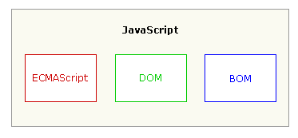
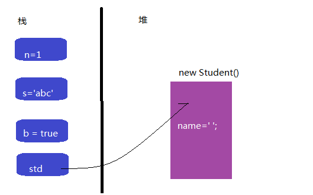
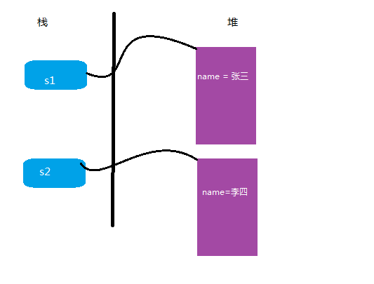
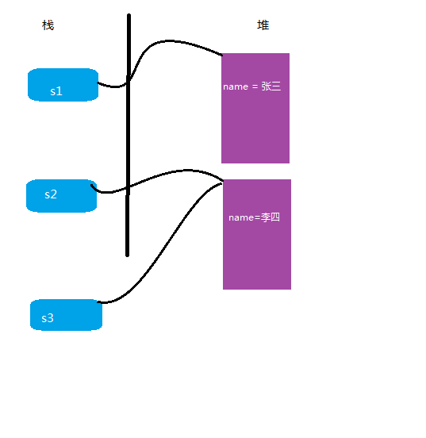

# 
javascript高级 第七章
 #

# 1. 上章内容回顾与预习检查 #

## 1.1 上章内容回顾 #

　　1. 闭包 
　　  

## 1.2 预习检查 #

　　1. 对象的创建方式  
　

# 2. 本章任务 #

　　1. 
　　2.     
  

# 3. 本章内容 #

　　1. javascript创建对象的两种方式 
　　2. 私有属性和方法的声明 
　　3. 静态变量和方法

　　

# 3.1 ECMAScript #

## 3.1.1 ECMAScript概述 ##
一个完整的 JavaScript 实现是由以下 3 个不同部分组成的：

　　　

尽管 ECMAScript 是一个重要的标准，但它并不是 JavaScript 唯一的部分。我们使用的javascript语言是依据ECMAScript的标准实现的，javascript中的绝大部分特性和ECMAScript中的标准是一致。我们现在的使用的是ECMAScript5的标准，这也是大多数浏览器所支持的。在2016年初突出了ECMAScript6的标准，目前的浏览器支持的不是很好，但它是个趋势，现在node环境能完全支持。  
既然javascript是依据ECMAScript5来实现的，有关数据类、函数、逻辑语句等都和ES相同，这这里就不在赘述，本章重点讲解ECMAScript5的面向对象的概念。

# 3.2 面向对象基本概念 #
## 3.2.1 面向对象术语  ##

1.对象  
ECMA 把对象（object）定义为“属性的无序集合，每个属性存放一个原始值、对象或函数”。严格来说，这意味着对象是无特定顺序的值的数组。
尽管 ECMAScript 如此定义对象，但它更通用的定义是基于代码的名词（人、地点或事物）的表示。  
2.类  
每个对象都由类定义，可以把类看做对象的配方。类不仅要定义对象的接口（interface）（开发者访问的属性和方法），还要定义对象的内部工作（使属性和方法发挥作用的代码）。编译器和解释程序都根据类的说明构建对象。  
3.实例  
程序使用类创建对象时，生成的对象叫作类的实例（instance）。对类生成的对象的个数的唯一限制来自于运行代码的机器的物理内存。每个实例的行为相同，但实例处理一组独立的数据。由类创建对象实例的过程叫做实例化（instantiation）。   
 
注意ECMAScript5 并没有正式的类。相反，ECMA 把对象定义描述为对象的配方。这是 ECMAScript 逻辑上的一种折中方案，因为对象定义实际上是对象自身。即使类并不真正存在，我们也把对象定义叫做类，因为大多数开发者对此术语更熟悉，而且从功能上说，两者是等价的。  
接下来让我们看看在JavaScript里如何替代OOP模型，也就是我们所建议的基于原型的OOP。
# 3.2 ECMAScript中的对象 #
## 3.2.1 对象字面量 ##

　　这里的基本概念是动态可变对象。下面这样的对象可以独立存储他们所有的特性（属性，方法）而不需要的类。  

	 

我们会发现js中的对象表示方式和json的格式很相似，但其实还是有区别的，严格要求下json格式中的key是需要使用"引起来的，js对象的表示是不需要的。js中的对象是可以动态增加属性和方法的。  

有些属性不能被修改——（只读属性、已删除属性或不可配置的属性），ES5规范规定，静态对象不能扩展新的属性，并且它的属性页不能删除或者修改。他们是所谓的冻结对象，可以通过应用Object.freeze(o)方法得到。

	

在ES5规范里，也使用Object.preventExtensions(o)方法防止扩展，或者使用Object.defineProperty(o)方法来定义属性：  

	

对象字面量的方式，目前有一个最大的缺点，就是这种对象不能反复创建，可以使用构造函数的方式解决这种问题。
## 3.2.2 构造函数方式 ##
	
	

# 3.3 对象的内存分配  #

在讲这些内容之前我们先了解对象和基本类型之前的区别。

javascript中数据类型分为两大类，一种叫做基本类型，一种叫做引用类型(对象)。  

	

上面的例子中 number,string,boolean都为引用类型，object为引用类型。他们的区别于创建不同类型的变量在不同的内存空间分配，基本类型在栈区，对象堆。我们等于使用栈区std应用堆中的对象new Student(); 

通过new在堆中开辟空间，在调用构造函数Student()来初始化对象中的数据。  
  

	

内存的分配可以表示成下图的样子，每一个对象将维护自己的一套属性，也就是说是s1的属性name是张三，s2的属性name是李四。
  

那么我要是在对象间赋值，和基本类型间赋值有什么区别吗？其实本质上是没有区别。都是将自身内存中的数据赋给等号左边的变量。

	

# 3.4 私有属性和方法  #
对象有属性和方法，在我们以前的课程中已经实现，但这些属性和方法我们可以看做是公有的属性的方法。比如：  

	

公有属性和方法可以被对象在函数外面所使用，s1.name和s1.sayhello()。假如我们有的属性和方法不想被外界访问到，那么就可以定义成私有的。比如：  

	

公有属性和方法可以在函数内面所使用，但在外界是不可以被调用，只想供对象内部的所使用的属性和方法就可以定义成为私有的。  

# 3.5 静态变量和函数 #

实例变量和方法只能被对象所调用，也就是说没有对象这些东西是不会创建的。静态变量和函数不属于实例对象，它属于函数对象本身（函数对象的知识下一章再讲），实例对象访问不到。  

	

比如我们想要记录创建对象的个数，就可以使用静态成员：  

	

## 3.6 getter和setter方法 ##

getter和setter方法叫做getter访问器和setter访问器，它的作用是对属性提供赋值和获取的方法。并且在赋值和获取属性值时可以增加一些业务的逻辑。比如一个人的年龄，我们在赋值没有任何限制，给一个负数也可以，但这种情况不符合我们实际的场景要求，这个时候就可以使用setter方法做有有效性判断。下面的案例我们来完成对价格进行进行打折。

请参照案例 getter和setter 案例

## 3.7 案例 ##
   百度星座案例
# 总结 #
   本章主要讲解在javascript中创建对象的两种方法和对象属性的讲解。
# 预习 #
　　

