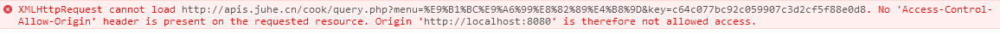

# 
javascript高级 第三章
 #

# 1. 上章内容回顾与预习检查 #

## 1.1 上章内容回顾 #

　　1. 同步和异步请求的区别 
　　2. 原生AJAX的三个步骤
　　  

## 1.2 预习检查 #

　　1. JQery框架异步请求常用的方法有哪些  
　　2. 跨域的涵义
　

# 2. 本章任务 #

　　1. 天气预报
　　2. 菜谱    
  

# 3. 本章内容 #

　　1. Jquery ajax请求
　　2. 跨域请求   
　　3. artTemplate模板的使用  

　　

# 3.1 JQuery AJAX请求 #

## 3.1.1 JQery ajax方法 ##

　　　

　　　
## 3.1.2 jquery的ajax返回类型.web  ##

　　　预期服务器返回的数据类型。如果不指定，jQuery 将自动根据 HTTP 包 MIME 信息来智能判断，比如XML MIME类型就被识别为XML。随后服务器端返回的数据会根据这个值解析后，传递给回调函数。可用值: 

"xml": 返回 XML 文档，可用 jQuery 处理。

"html": 返回纯文本 HTML 信息；包含的script标签会在插入dom时执行。

"script": 返回纯文本 JavaScript 代码。不会自动缓存结果。除非设置了"cache"参数。'''注意：'''在远程请求时(不在同一个域下)，所有POST请求都将转为GET请求。(因为将使用DOM的script标签来加载)

"json": 返回 JSON 数据 。

"jsonp": JSONP 格式。使用 JSONP 形式调用函数时，如 "myurl?callback=?" jQuery 将自动替换 ? 为正确的函数名，以执行回调函数。

"text": 返回纯文本字符串

请参考示例1~4
　　　　 
   

## 3.1.3 请求方式和传递参数 ##

　　请求的提交方式通过type来设置，常用的get和post，默认为get。
　　data：发送到服务器的数据。将自动转换为请求字符串格式。GET 请求中将附加在 URL 后。查看 processData 选项说明以禁止此自动转换。必须为 Key/Value 格式。如果为数组，jQuery 将自动为不同值对应同一个名称。如 {foo:["bar1", "bar2"]} 转换为 "&foo=bar1&foo=bar2"。

请参考示例5

注意：get方式提交数据，同样也会缓存数据，造成数据无法跟新，可以使用cache来设置。默认: true,dataType为script和jsonp时默认为false) jQuery 1.2 新功能，设置为 false 将不缓存此页面。

 

# 3.2 跨域问题 #

## 3.2.1 为什么要做跨域  ##
　　　比如我们做的网站上要显示天气信息，但我们没用能力监测全国各地的天气信息。这个时候有另外一个网站提供了天气信息的数据接口，这个时候就需要自己的网站访问别人网站的接口。这就叫做跨域请求。
　　　
## 3.2.2 跨域请求问题 ##

　　　1.第一种方式，客户端浏览器想自己的服务器发送AJAX请求，后台服务器获得请求后，再通过程序向其他服务器请求数据，拿到数据后再讲数据返回给客户端浏览器。这种方式必须有后台处理客户端请求的程序才可以完成。 
 
　　　2.第二种方式：客户端浏览器直接访问其他程序提供的数据接口，不通过自己后台服务器来完成。但是这种方式浏览器是不允许的，也就是说AJAX不允许做跨域请求。除非服务器端设置相应的请求头才可以，但一般的都不去设置的。

## 3.2.3 解决跨域的问题 ##

　　　解决跨域请求的问题，目前使用jsonp的办法实现。  
　　　JSONP(JSON with Padding)是JSON的一种“使用模式”，可用于解决主流浏览器的跨域数据访问的问题。由于同源策略，一般来说位于 server1.example.com 的网页无法与不是 server1.example.com的服务器沟通，而 HTML的script元素是一个例外。利用 script 元素的这个开放策略，网页可以得到从其他来源动态产生的 JSON 资料，而这种使用模式就是所谓的 JSONP。用 JSONP 抓到的资料并不是 JSON，而是任意的JavaScript，用 JavaScript 直译器执行而不是用 JSON 解析器解析。

示例 cros.html  
		
		<!doctype html>
		<html lang="en">
		<head>
			<meta charset="UTF-8">
			<title>跨域问题</title>
		
			
			
		</head>
		<body>
			
		</body>
		</html>

  cros.js
    
		hello({username:123,password:456});
  
查看运行结果
## 3.2.4 案例 ##

   请参照案例1 天气预报。
　 

# 3.3  封装跨域的函数 #

## 3.3.1 封装函数 ##

代码

	
## 3.3.1 案例 ##
   请参照案例2 天气预报。使用自己封装的函数重构天气预报。
　 

   

# 3.4  JQuery的jsonp #

	
	$.ajax(  
	    {  
	        type:'get',  
	        url : 'url',//请求的地址 
	        dataType : 'jsonp',  //返回的数据类型必须为jsonp
	        jsonp:"callback", //发送请求jspon参数的名字
	        jsonpCallback:"callback",//jspon参数的值，也就是回调方法名
	        success  : function(data) {  
	            console.log(data);
	        },  
	        error : function() {  
	            alert('fail');  
	        }  
	    }  
	);  

 代码说明：dataType必须是jsonp，表示返回的数据为jsonp。jsonp:"callback"，发送请求jspon参数的名字。jsonpCallback:"callback"，jspon参数的值，也就是回调方法名。jsonp和jsonpCallback这两个属性是可以省略的，jsonp的默认值就是callback，jsonpCallback省略的话，jquery会生成一个随机的回调方法名，并调用到success指定方法，为了更像访问json数据一样。

# 3.5 补充知识 artTemplate模板 #

## 3.5.1 artTemplate模板下载 ##
   artTemplate模板下载能帮助我们快速的展示数据及重用。
   第一步：打开github并搜索artTemplate
  　

   第二步：打开点击搜获结果
   

   第三步：下载
   
## 3.5.2 artTemplate模板原生语法基本讲解 ##

	<!DOCTYPE html>
	<html lang="en">
	<head>
	    <meta charset="UTF-8">
	    <title>Title</title>
	    
	    
	
	    
	
	    
	</head>
	<body>
	
	    

	
	    

	</body>
	</html>　　

## 3.5.3 案例 ##
请参照案例4 菜谱。
# 总结 #
   本章主要讲解了Jquery的跨域请求，并通过原生的方式完成跨域请求，讲解了跨域请求的原理。
# 预习 #
　　

