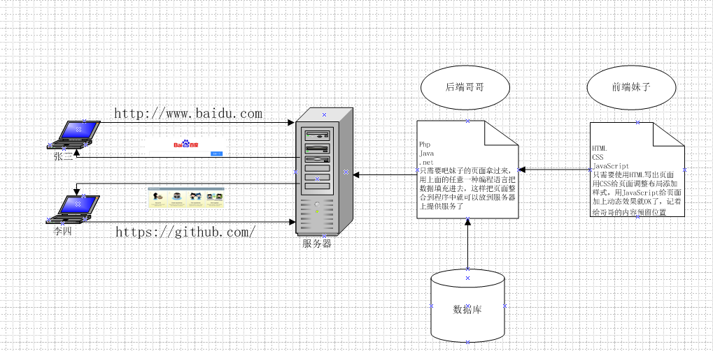
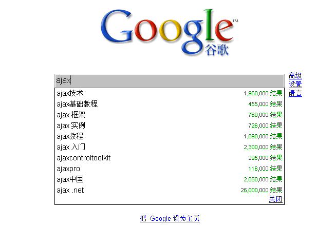
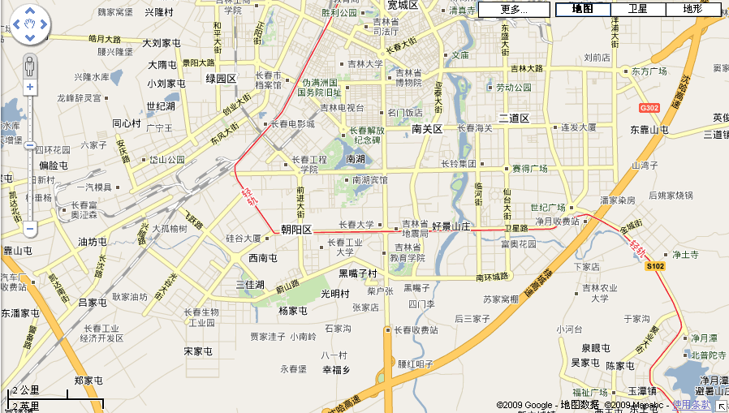
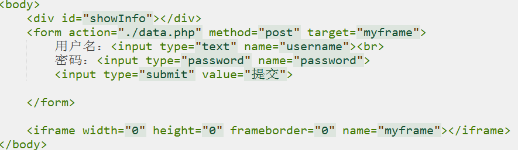
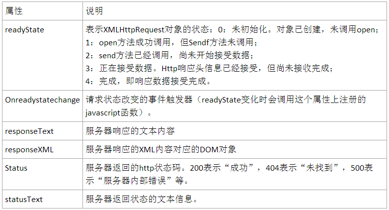

# 
javascript高级 第二章
 #

# 1.复习检查 #

　　1.正则表达式对象创建的方式  
　　2.常用的符号有哪些

# 2. 本章任务 #

　　1.展示电影信息
　　     
# 3. 本章内容 #

　　1. 理解同步和异步请求  
　　2. 使用XMLHttpRequest对象实现异步请求   
　　3. 封装原生ajax
　　
　　

# 3.1 静态网站和动态网站

## 3.1.1 特点 ##
   静态网站：包括html页面、css文件、js文件、图片…，一旦完成，就无法改变。  
   动态网站：由于静态网站在维护的局限性，所以产生了动态网站
   实现动态网站的技术：php/jsp/.net/python。。。

   动态网站的原理：浏览器请求动态网站的页面（*.php），php拼接数据并动态生成html页面，然后将新生成的页面返回给浏览器。

　　
## 3.1.2 同步请求和异步请求 ##

   1.同步请求  
　　发送方发出数据后，等接收方发回响应以后才发下一个数据包的通讯方式。  
　　提交请求->等待服务器处理->处理完毕返回，这个期间客户端浏览器不能干任何事。特点：页面会造成白屏，整个页面会刷新。

   2.异步请求  
　　请求通过事件触发->服务器处理（这是浏览器仍然可以作其他事情）->处理完毕。特点：局部更新页面不会全屏刷新

# 3.2 异步请求 #
   异步请求案例
　　
　　
## 3.2.1 iframe实现异步局部跟新 ##
　　
表单提交后的相应页面返回到iframe当中，主页面内容不变

## 3.2.2 原生ajax实现异步通信 ##
   客户端向服务器端发送请求，需要指定请求的地址URL（统一资源定位符）  
   URL:统一资源定位符（Uniform Resource Locator）  
   完整的URL由如下几部分组成：  
   scheme://host:port/path?query#fragment
   schema:通信协议，常用的有：http/ftp  
   host:主机，服务器（计算机）域名或IP地址  
   port:端口，整数，可选，省略时使用默认端口，http的默认端口是80  
   path:路径，由零或多个”/”符号隔开的字符串，一般用来表示主机的一个目录或者文件地址  
   query:查询 可选，用于给动态网页（如使用CGI、ISAPI、PHP/JSP/ASP/ASP.NET等技术制作的网页）传递参数，可有多个参数，用"&"符号隔开，每个参数的名和值用"="符号隔开。  
   fragment:信息片断 字符串，用于指定网络资源中的片断。例如一个网页中有多个名词解释，可使用fragment直接定位到某一名词解释。(也称为锚点.)  

   服务器返回数据，常用格式为json和xml。
# 3.3 XMLHttpRequest对象 #

## 3.3.1 什么是 XMLHttpRequest 对象 ##
　　XMLHttpRequest 对象用于在后台与服务器交换数据。  
　　XMLHttpRequest 对象是开发者的梦想，因为您能够：  
　　　1.在不重新加载页面的情况下更新网页  
　　　2.在页面已加载后从服务器请求数据  
　　　3.在页面已加载后从服务器接收数据  
　　　4.在后台向服务器发送数据  
　　　
## 3.3.2步骤一： 创建XMLHttpRequest 对象 ##

　　所有现代浏览器 (IE7+、Firefox、Chrome、Safari 以及 Opera) 都内建了 XMLHttpRequest 对象。通过一行简单的 JavaScript 代码，我们就可以创建 XMLHttpRequest 对象。  
　　创建 XMLHttpRequest 对象的语法：  
		xmlhttp=new XMLHttpRequest();  
　　老版本的 Internet Explorer （IE5 和 IE6）使用 ActiveX 对象：  
		xmlhttp=new ActiveXObject("Microsoft.XMLHTTP");

兼容写法：

	xmlhttp=null;
	if (window.XMLHttpRequest)
	  {// code for all new browsers
	  xmlhttp=new XMLHttpRequest();
	  }
	else if (window.ActiveXObject)
	  {// code for IE5 and IE6
	  xmlhttp=new ActiveXObject("Microsoft.XMLHTTP");
	  }

## 3.3.3 步骤二：发送请求 ##
  
　　创建XMLHttpRequest对象成功后，就可以像服务器发送请求了。

	if (xmlhttp!=null)
	  {
	  xmlhttp.onreadystatechange=state_Change;
	  xmlhttp.open("GET",url,true);
	  xmlhttp.send(null);
	  }
	else
	  {
	  alert("Your browser does not support XMLHTTP.");
	  }

xmlHttp.open(“方式”,”地址”,”标志位”);//初始化请求   
xmlHttp.onreadystatechange =function(){}//指定回调函数  
xmlHttp.send();//发送请求

示例演示

## 3.3.3.1 带参数的提交 ##

   （1）get方式提交：注意提交数据有中文的情况，应该使用encodeURIComponent()进行URI转码后再提交;  

		

  （2）post方式提交：send的参数如果是以Post方式发出的话，可以是任何想传给服务器的内容。注意:如果要传文件或者Post内容给服务器，必须先调用setRequestHeader方法，修改MIME类别。如下：
xmlhttp.setRequestHeader("Content-Type","application/x-www-form-urlencoded");这时参数则以查询字符串的形式列出，作为send的参数，

	
     
## 3.3.4 步骤三：编写回调函数 ##

	function state_Change()
	{
	if (xmlhttp.readyState==4)
	  {// 4 = "loaded"
	  if (xmlhttp.status==200)
	    {// 200 = OK
	    // ...our code here...
	    }
	  else
	    {
	    alert("Problem retrieving XML data");
	    }
	  }
	}
   服务器处理完请求后，将结果返回给客户端，客户端将执行回调函数。

  （1）responseXML
如果服务器返回的是 XML， 那么数据将储存在 responseXML 属性中。
只用服务器发送了带有正确首部信息的数据时， responseXML 属性才是可用的。 MIME 类型必须为 text/xml  
   (2)responseText
XMLHttpRequest 的 responseText 属性包含了从服务器发送的数据。它是一个HTML,XML或普通文本，这取决于服务器发送的内容。

	

# 3.4 案例 #
案例一：异步获取电影信息
# 3.5 封装原生ajax #
	
	function ajax(data){
		//data={data:"",dataType:"xml/json",type:"get/post"，url:"",asyn:"true/false",success:function(){},failure:function(){}}
	
		//data:{username:123,password:456}
		//data = 'username=123&password=456';
		//第一步：创建xhr对象
		var xhr = null;
		if(window.XMLHttpRequest){//标准的浏览器
			xhr = new XMLHttpRequest();
		}else{
			xhr = new ActiveXObject('Microsoft.XMLHTTP');
		}
		//第二步：准备发送前的一些配置参数
		var type = data.type == 'get'?'get':'post';
		var url = '';
		if(data.url){
			url = data.url;
			if(type == 'get'){
				url += "?" + data.data + "&_t="+new Date().getTime();
			}
		}
		var flag = data.asyn == 'true'?'true':'false';
		xhr.open(type,url,flag);
	
		//第三步：执行发送的动作
		if(type == 'get'){
		   xhr.send(null);
		}else if(type == 'post'){
		   xhr.setRequestHeader("Content-Type","application/x-www-form-urlencoded");
		   xhr.send(data.data);
		}
	
		//第四步：指定回调函数
		xhr.onreadystatechange = function(){
			if(this.readyState == 4){
				if(this.status == 200){
					if(typeof data.success == 'function'){
						var d = data.dataType == 'xml'?xhr.responseXML:xhr.responseText;
						data.success(d);
					}
				}else{
					if(typeof data.failure == 'function'){
						data.failure();
					}
				}
			}
		}
	
	}

# 总结 #

　　理解AJAX原理，使用原生的方式发送异步请求的三个步骤。

# 预习 #
　　JQery框架实现异步请求以及跨域请求

