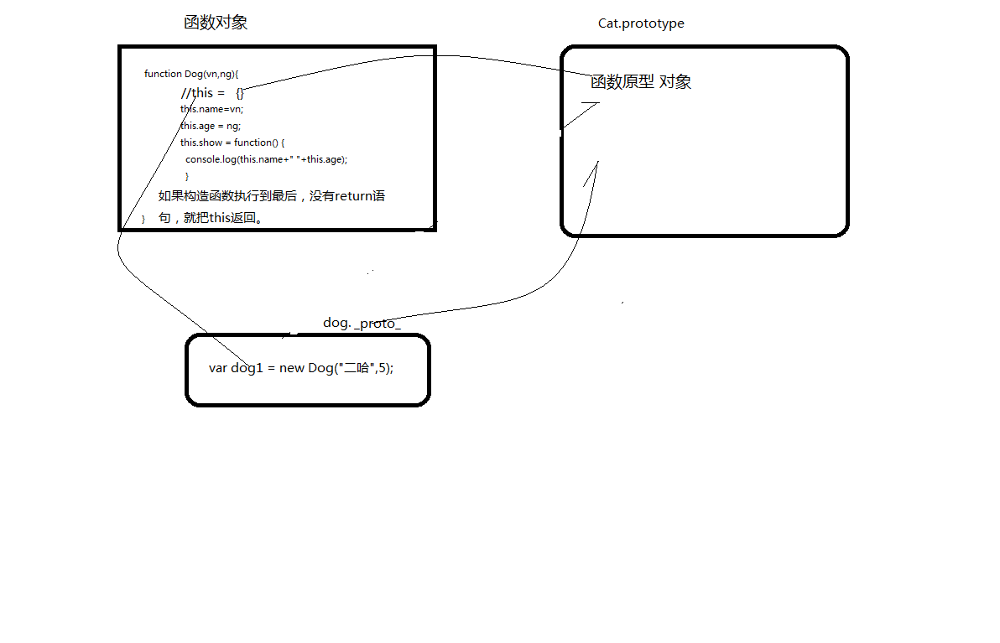
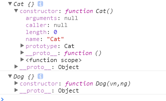
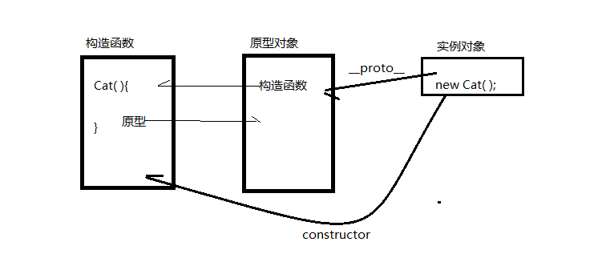
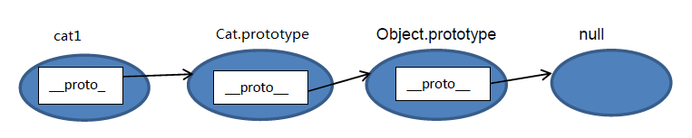
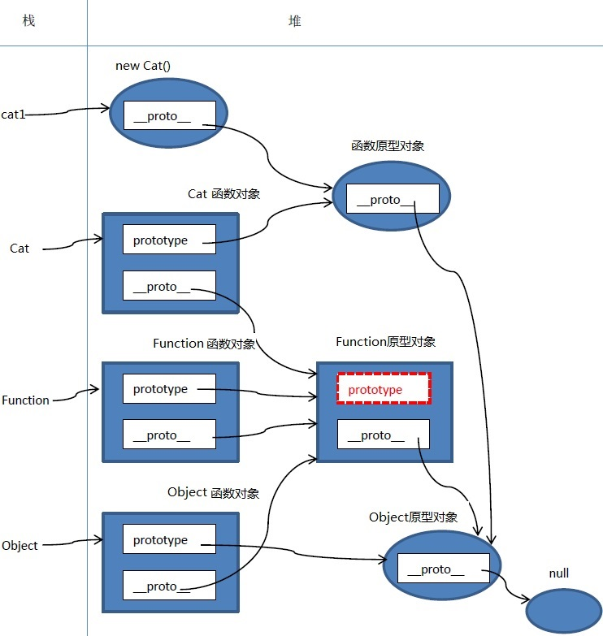
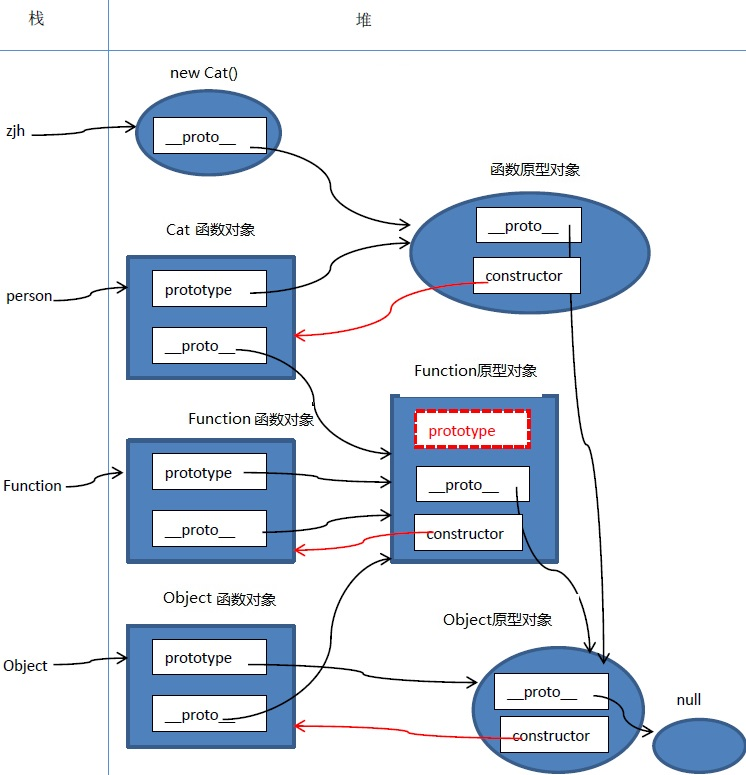
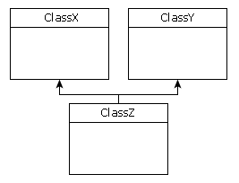

# 
javascript高级 第十章
 #

# 1. 上章内容回顾与预习检查 #

## 1.1 上章内容回顾 #

　　1.创建对象的两种方式  
　　2.私有属性和方法和公有属性方法的区别  
　　3.静态属性和方法的特特点
　　  

## 1.2 预习检查 #

　　1. 对象的分类  
　　2. 原型链  
　　3. 继承的实现
　

# 2. 本章任务 #

　　1.   
　　2.     
  

# 3. 本章内容 #

　　1. 原型对象  
　　2. 原型链的概念  
　　3. 继承     

　　

# 3.1 实例对象与函数对象 #

JavaScript 中，万物皆对象！但对象也是有区别的。分为实例对象和函数对象，Object ，Function 是JS自带的函数对象（在javascript中函数本身也是对象，就像上节课中讲到的静态变量和方法就用到了函数自身）。下面举例说明

	

在上面的例子中 o1 o2 o3 为普通对象，f1 f2 f3 为函数对象。怎么区分，其实很简单，凡是通过 new Function() 创建的对象都是函数对象，其他的都是实例对象。f1,f2,归根结底都是通过 new Function()的方式进行创建的。Function Object 也都是通过 New Function()创建的。

现在我们重点说一说实例对象，实例对象是通过new 构造函数的方式创建，那么new到底都作了点什么呢？

new: 内部的原理  
   第一步： 在内存中开辟一块空间。   
   第二步：创建一个新空对象。  
   第三步： 把this 指向到这个空对象。  
   第四步： 把空对象的 内部原型 指向 构造函数的原型对象。  
   第五步： 当构造函数执行完成后，如果么有return的话，那么把当前
   空对象返回。

# 3.2 原型对象  #
　　　在JavaScript 中，每当定义一个函数对象的时候，函数对象中都会包含一些预定义的属性。其中函数对象的一个属性就是原型对象 prototype。

## 3.2.1 prototype属性 ##

　　　该对象的对象原型的引用。对于所有的对象，默认返回Object对象的一个实例（Function.prototype除外,它是函数对象，但它很特殊）。对象原型可以理解为该类型的描述。输出Cat函数原型和Dog函数原型，查看结果。  

	

	console.log(Cat.prototype);
	console.log(Dog.prototype);
	console.log(typeof Cat.prototype);
    console.log(typeof Dog.prototype);
  
 ，从这句console.log(Cat.prototype) 的输出就结果可以看出，原型对象实际上就是构造函数的一个实例对象，和普通的实例对象没有本质上的区别。可以包含特定类型的所有实例的共享属性或者方法。

　　　刚才我们也提到了，实例对象中的内部原型对象__proto__属性，它表示创建该对象的函数原型对象是谁。  

	cat1.__proto__ === Cat.prototype //true
　　　

## 3.2.3 constructor属性 ##

　　　创建对象的函数引用。其实就是自身的函数对象。也就是说这个属性为对象提供了类。  

	console.log(cat1.constructor===Cat); //true

　　　在javascript中任何函数都可以用作构造函数，并调用构造函数时需要用到一个prototype属性的。因此，每一个javascript函数都有一个prototype属性。这个属性的值是一个对象（原型对象），这个对象中包含一个constructor属性，这个属性是一个函数对象。  

	var p = Cat.prototype;
	var c= p.constructor;
	console.log(cat1.constructor===c); //true

  

# 3.3 操作原型  #

   原型对象其实就是对该类型的属性方法的描述，根据原型的特点，我们修改以上的Dog类。

代码

	function Dog(vn,ng){
			this.name=vn;
			this.age = ng;
		}
		Dog.prototype.show = function(){
			console.log(this.name+" "+this.age);
		};
		var dog2 = new Dog("拉登",3);
		dog2.show();

注意，一般我们在声明属性要写在构造函数中，构造函数用来初始化数据，原型中定义方法。那好我们在看一段代码，  

    

上述的例子中，原型分两次修改，dog2是否有playgame()方法。运行结果会报错Uncaught TypeError: dog2.playgame is not a function。为什么？原型变了，按理说通过此原型创建的的对象都应该发生变化。实际上不行，因为这时候原型还没有发生变化 但是写到注释的位置就可以了，这是由于调用发生在原型已经变化之后，所以就没有问题了。 

但在有些情况，我们可以使用__proto__显式属性来引用对象的原型：  
	
	

# 3.4 改变原型对象 #

	

上述代码执行没有任何错误，但是存在一些问题。我们来看执行下面语句
	console.log(Range.prototype.constructor);
	console.log(r.constructor);
我们发现它指向的构造函数是Object而不是构造函数Range，我们可以手动进行补救。
方法一：  

	Range.prototype={
			constructor:Range,//手动方式制定构造函数
			include:function(x){
				return this.from<=x && x<=this.to;
			},
			foreach:function(f){
				for (var i = Math.ceil(this.from); i <= this.to; i++) {
					f(i);
				}
			},
			toString:function(){return this.from+"..."+this.to}
		};
方法二： 常见的解决办法是使用预定义的原型对象，预定义的原型对象包含constructor属性，然后依次给原型对象添加方法；也就是扩展预定义的Range.prototype对象，而不重写之,这样就自动创建Range.prototype.constructor属性 

	Range.prototype.include = function(x){
				return this.from<=x && x<=this.to;
			};
		Range.prototype.foreach = function(f){
				for (var i = Math.ceil(this.from); i <= this.to; i++) {
					f(i);
				}
			};
		Range.prototype.toString= function(){return this.from+"..."+this.to};

# 3.5 通过实例对象的构造属性创建对象 #

为实例的原型独立于构造函数和构造函数的prototype属性，构造函数完成了自己的主要工作（创建对象）以后可以删除。原型对象通过引用Prototype属性继续存在：  

	

# 3.6 原型链 #

原型链是JS实现继承的一种模型，那么构成原型链的是__proto__而非prototype属性。哪到底什么是原型链呢。我们先看一个案例  

	

我们把这个有__proto__串起来的直到Object.prototype.__proto__为null的链叫做原型链。如下图：

 

为了更加深入和直观的进行理解，下面我们画一下上面的内存结构图：

 

疑点解释：

1.Object.__proto__ === Function.prototype   // true

Object是函数对象，是通过new Function()创建，所以Object.__proto__指向Function. prototype。

2.Function.__proto__ === Function.prototype  // true

Function 也是对象函数，也是通过new Function()创建，所以Function.__proto__指向Function. prototype。

自己是由自己创建的，好像不符合逻辑，但仔细想想，现实世界也有些类似，你是怎么来的，你妈生的，你妈怎么来的，你姥姥生的，……类人猿进化来的，那类人猿从哪来，一直追溯下去……，就是无，（NULL生万物）正如《道德经》里所说“无，名天地之始”。

3.Function.prototype.__proto__ === Object.prototype //true

其实这一点我也有点困惑，不过也可以试着解释一下。

Function.prototype是个函数对象，理论上他的__proto__应该指向 Function.prototype，就是他自己，自己指向自己，没有意义。

JS一直强调万物皆对象，函数对象也是对象，给他认个祖宗，指向Object. prototype。Object. prototype.__proto__ === null，保证原型链能够正常结束。
## 3.6.1 constructor属性 ##
原型对象prototype中都有个预定义的constructor属性，用来引用它的函数对象。这是一种循环引用

person.prototype. constructor === person  //true

Function.prototype.constructor === Function //true

Object.prototype.constructor === Object //true

完善内存结构图：

 

# 3.7 继承 #

javascript本身不是真正意义上的面向对象的语言，它是基于对象的语言。但它有想要实现面向对象的特性。本节将主要讲解OOP在javascript中的实现。  
继承是面向对象中非常重要的一个概念，继承其实就是通过现有类创建新类的过程。它本身就是拿来主义的思想，已经存在的就不在重新创建，只需要拿来归为己用。这种思想也是代码重用的思想，代码的复用。在javascript中要想实现继承可以使用四种方式。

## 3.7.1 对象冒充 ##
它是在开发者开始理解函数的工作方式，尤其是如何在函数环境中使用 this 关键字后才发展出来。它本不属于真正意义上的继承。  
工作原理： 构造函数使用 this 关键字给所有属性和方法赋值（即采用类声明的构造函数方式）。因为构造函数只是一个函数，所以可使 Richer 构造函数成为 Richer2nd 的方法，然后调用它。Richer2nd 就会收到 Richer 的构造函数中定义的属性和方法。例如，用下面的方式定义 Richer 和 Richer2nd： 

	

有趣的是，对象冒充可以支持多重继承。也就是说，一个类可以继承多个超类。用 UML 表示的多重继承机制如下图所示：  

 

	 

这里存在一个弊端，如果存在两个类 ClassA 和 ClassB 具有同名的属性或方法，那么就会被覆盖。除这点小问题之外，用对象冒充实现多重继承机制轻而易举。
由于这种继承方法的流行，ECMAScript 的第三版为 Function 对象加入了两个方法，即 call() 和 apply()。

## 3.7.2 call() 和 apply()实现继承  ##

call() 方法是与经典的对象冒充方法最相似的方法。它的第一个参数用作 this 的对象。其他参数都直接传递给函数自身。例如：

	function sayColor(sPrefix,sSuffix) {
	    alert(sPrefix + this.color + sSuffix);
	};
	
	var obj = new Object();
	obj.color = "blue";
	
	sayColor.call(obj, "The color is ", "a very nice color indeed.");

在这个例子中，函数 sayColor() 在对象外定义，即使它不属于任何对象，也可以引用关键字 this。对象 obj 的 color 属性等于 blue。调用 call() 方法时，第一个参数是 obj，说明应该赋予 sayColor() 函数中的 this 关键字值是 obj。第二个和第三个参数是字符串。它们与 sayColor() 函数中的参数 sPrefix 和 sSuffix 匹配，最后生成的消息 "The color is blue, a very nice color indeed." 将被显示出来。
接下来我们使用call()来完成继承：

	

## 3.7.3 原型方式  ##

继承这种形式在 ECMAScript 中原本是用于原型链的。上一章介绍了定义类的原型方式。原型链扩展了这种方式，以一种有趣的方式实现继承机制。
在上一章学过，prototype 对象是个模板，要实例化的对象都以这个模板为基础。总而言之，prototype 对象的任何属性和方法都被传递给那个类的所有实例。原型链利用这种功能来实现继承机制。  

	

这种方式补足之处有二，一、不能实现多继承。二、就像上面的的例子中，从父类中继承的name属性无法再构造函数中赋值，标准做法是要确保构造函数没有任何参数，我们使用‘.’运算符操作属性。   
 
    

## 3.7.4 混合模式 ##

这种继承方式使用构造函数定义类，并非使用任何原型。对象冒充的主要问题是必须使用构造函数方式，这不是最好的选择。不过如果使用原型链，就无法使用带参数的构造函数了。开发者如何选择呢？答案很简单，两者都用。
在前一章，我们曾经讲解过创建类的最好方式是用构造函数定义属性，用原型定义方法。这种方式同样适用于继承机制，用对象冒充继承构造函数的属性，用原型链继承 prototype 对象的方法。用这两种方式重写前面的例子，代码如下：

    

# 3.8 重写父类方法 #

方法重写：在子类中重写父类的方法。比如父类的方法不能满足子类的需要，这时候就可以重写父类方法。重写是要注意子类的方法名一定要和父类的方法名一致，才可以成功重写。比如  

    

成功调用，被重写的父类方法就不会被调用，父类的方法被子类方法所覆盖。但大家仔细观察，在子类中重写的方法sale（）中的部分功能其实在父类中已经被实现，我们在实现一次是不是一种浪费？答案是肯定的，哪我们怎么在子类中调用到父类的方法而减少代码的重新实现呢？  

	

上面代码实现了在子类中调用父类中被重写的方法，当然这种比较麻烦，有没有简单方式呢？给大家推荐一个js类库，它可以帮助我们创建对象，并支持面向对象的一些特征。
	

    

# 3.9 面向对象三大特性 #
面向对象的三大特性：封装、继承、多态，在javascript本身不是真正意义上的面向对象，但也可以模拟出上述的特性，在这里我们就简单了解一下。
## 3.9.1 封装 ##
所谓封装就是将属性或方法组织在一起，并想外界有选择的隐藏。类其实就是一种封装，将属性和方法组织成一个整体。
## 3.9.2 继承 ##
继承，就是通过现有类创建新类的过程，上面讲了很多就不在这里赘述了。
## 3.9.3 多态 ##
我们先说一说开闭原则，开闭原则具有理想主义的色彩，它是面向对象设计的终极目标。  

遵循开闭原则设计出的模块具有两个主要特征：   
（1）对于扩展是开放的（Open for extension）。这意味着模块的行为是可以扩展的。当应用的需求改变时，我们可以对模块进行扩展，使其具有满足那些改变的新行为。也就是说，我们可以改变模块的功能。  
（2）对于修改是关闭的（Closed for modification）。对模块行为进行扩展时，不必改动模块的源代码或者二进制代码。  

因此，针对开闭原则的实现方法，一直都有面向对象设计的大师费尽心机，研究开闭原则的实现方式。后面要提到的里氏替换原则（LSP）、依赖倒转原则（DIP）、接口隔离原则（ISP）以及抽象类（Abstract Class）、接口(Interface)等等，都可以看作是开闭原则的实现方法。

里氏替换原则（LSP）作为OO的高层原则，主张使用“抽象(Abstraction)”和“多态(Polymorphism)”将设计中的静态结构改为动态结构，维持设计的封闭性。 它的含义就是凡是父类可以出现的的地方都可以被子类所替换。

多态性：它就是里氏替换原则的体现。多态是具有表现多种形态的能力的特征，在OO中是指，语言具有根据对象的类型以不同方式处理之，特别是重载方法和继承类这种形式，的能力。多态被认为是面向对象语言的必备特性。

## 3.6 案例 ##
案例 轮播图面向对象版
# 总结 #
   本章主要讲解在javascript中创建对象的两种方法，以及对创建对象原理的一些剖析。
# 预习 #
　　

